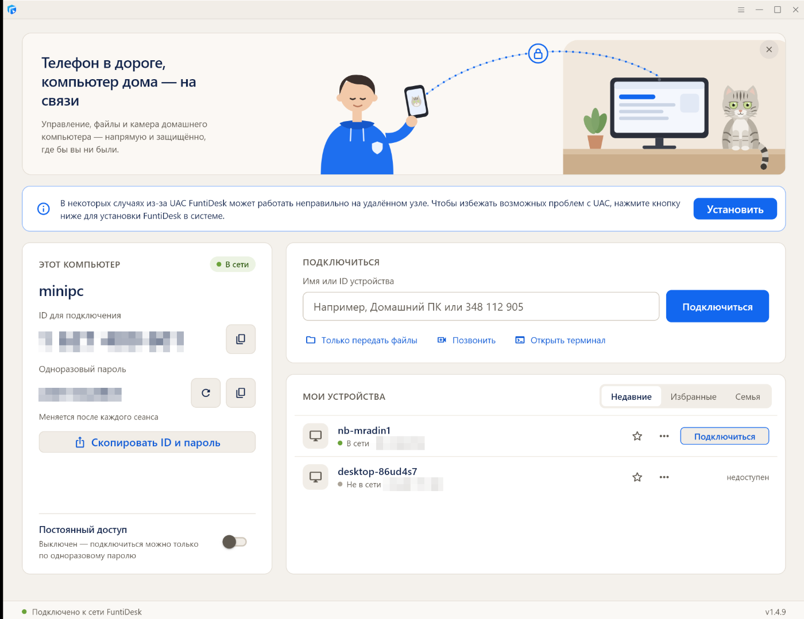
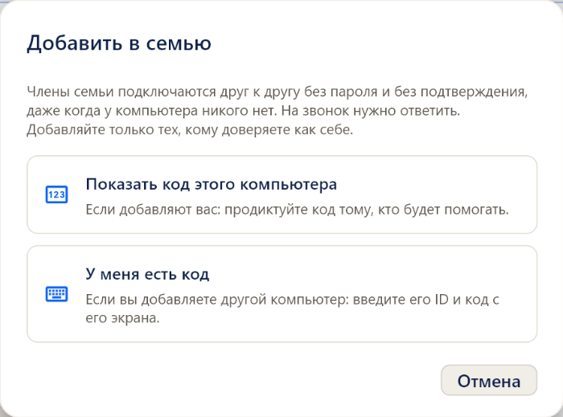

# FuntiDesk

**Удалённый доступ, звонки и помощь для своей семьи — через свой собственный сервер.**

Помочь маме с компьютером, забрать файл с домашнего ПК, позвонить домой с видео — без сторонних облаков, мессенджеров и чужих серверов. FuntiDesk работает только через инфраструктуру, которую вы контролируете сами.



## Чем FuntiDesk отличается

**Свой сервер — и больше ничего.** Клиент жёстко привязан к серверу FuntiDesk и его ключу. Никаких запасных публичных серверов: если сервер недоступен, клиент честно не подключится, а не уйдёт молча через чужую инфраструктуру.

**Не зависит от мессенджеров и облаков.** Звонки, управление и файлы идут напрямую между компьютерами или через ретранслятор на вашем сервере. Если сторонние сервисы блокируют или замедляют, FuntiDesk продолжает работать, пока доступен ваш сервер.

**Работает в «трудных» сетях.** Связь с сервером идёт по TCP, поэтому компьютер принимает подключения даже там, где провайдер или роутер режут входящий UDP — так бывает на мобильных и корпоративных сетях ([ADR-004](docs/ADR-004-tcp-signaling.md)).

**Сделан для семьи, а не для системных администраторов.** Понятные слова, крупные кнопки, без диктовки девятизначных ID при каждом звонке.

## Возможности

### Позвонить домой

Видеозвонок с голосом с одной кнопки «Позвонить». На той стороне звучит мелодия и появляется «Входящий звонок» — камера включается только после «Ответить». Видео в обе стороны, одно «положить трубку» завершает звонок на обоих компьютерах ([ADR-005](docs/ADR-005-family-calls.md)).

### Семья



Компьютеры родных сопрягаются **один раз** по коду из 6 цифр с экрана — дальше никаких паролей:

- члены семьи подключаются к управлению, файлам и терминалу сразу, на звонок — отвечают;
- каждому можно дать понятное имя: «Мама», «Ноутбук на даче»;
- удаление из семьи — взаимное: вас убирают и на той стороне.

Подлинность члена семьи подтверждается ключом устройства, поэтому выдать себя за «Мишу» нельзя ([ADR-006](docs/ADR-006-family-access.md)).

### Попросить помощи

Одна кнопка на компьютере мамы — и у выбранного помощника всплывает «Мама просит помощи» с кнопкой «Подключиться». Не нужно диктовать ID и пароль по телефону.

### Всё остальное, что нужно каждый день

- **Управление** компьютером, буфер обмена, экран входа Windows и окна администратора (после «Запросить повышение»).
- **Только передать файлы** — без показа экрана.
- **Открыть терминал** — командная строка удалённого компьютера.
- **Скопировать ID и пароль** — готовое сообщение для мессенджера одной кнопкой.
- **Мои устройства** — недавние, избранные, семья; статус «в сети».

## Безопасность

- Сервер и его ключ зашиты в клиент; соединения зашифрованы, подлинность собеседника проверяется ключом сервера (fail closed).
- Камера по одному паролю не включается: на звонок нужно ответить. Автоответ — отдельная настройка, по умолчанию выключен.
- Семья — только по коду с экрана этого компьютера; список семьи хранится на каждом устройстве, сервер о семьях ничего не знает.
- Никакого скрытого доступа: всё, что происходит на компьютере, видно на нём самом.

Подробно — [docs/SECURITY.md](docs/SECURITY.md).

## Установка на Windows

В PowerShell (без прав администратора):

```powershell
irm https://raw.githubusercontent.com/michailr1/FuntiDesk/main/install.ps1 | iex
```

Скрипт ставит последнюю сборку в `%LOCALAPPDATA%\Programs\FuntiDesk`, проверяет SHA256, добавляет ярлык в «Пуск» и запускает FuntiDesk. Повторный запуск обновляет программу, ID и настройки сохраняются. Пока установщик не попал в `main`, вместо `main` в ссылке — ветка `claude/rustdesk-fork-planning-324gyk`.

Без установки — один файл `FuntiDesk-portable.exe` из [последнего релиза](https://github.com/michailr1/FuntiDesk/releases/latest). Скачанный браузером файл SmartScreen предупреждает, пока у сборок нет подписи кода; установка командой выше этого предупреждения не вызывает.

## Android (тестовая сборка)

APK для телефонов arm64 — в релизах `funtidesk-android-<коммит>` (pre-release) на [странице релизов](https://github.com/michailr1/FuntiDesk/releases). Подпись отладочная: ставится вручную из файла, для проверки. Подробности — [docs/ANDROID.md](docs/ANDROID.md).

## Состояние

| | |
|---|---|
| Windows ↔ Windows: управление, файлы, терминал, P2P и ретранслятор | проверено на реальных компьютерах |
| Звонки: ответ, видео, голос, завершение с любой стороны | проверено; видео в обе стороны — проверено соединение, на двух компьютерах с камерами ещё нет |
| Семья, «Попросить помощи» | проверено на двух компьютерах |
| Android | тестовая сборка, проверка на телефоне впереди |
| iOS | в планах |

План — [docs/ROADMAP.md](docs/ROADMAP.md), результаты проверок — [docs/reviews/](docs/reviews/).

---

## Для разработчиков

### Цель продукта

Простой и надёжный удалённый доступ, при котором идентификация, rendezvous, relay, конфигурация, релизы и будущий слой управления устройствами контролируются инфраструктурой FuntiDesk.

### Принципы

- Все production-клиенты работают только через инфраструктуру FuntiDesk.
- Числовой ID устройства сохраняется как универсальный резервный способ подключения; поверх него — понятные имена, избранное, семья.
- Сначала Windows↔Windows, затем Android и iOS (Android начат раньше Family Release по решению владельца 2026-10-08).
- Собственный интерфейс и сценарии FuntiDesk, а не перекрашенный исходный проект.
- Изменения протокола и ядра — по возможности минимальные (собственные поля протокола — с номерами от 1000).
- Поведение, связанное с безопасностью, явное, задокументированное и fail closed.

### Этапы

1. **M0 — Архитектура**: baseline, стратегия форка, лицензирование, модель доверия.
2. **M1 — Self-hosted Server**: воспроизводимое развёртывание rendezvous/relay.
3. **M2 — Windows MVP**: Windows-клиент только на инфраструктуре FuntiDesk.
4. **M3 — End-to-End Validation**: P2P, relay, NAT, перезагрузка, UAC/экран входа, файлы.
5. **M4 — Family Release**: свой интерфейс, установка одной командой, семья, звонки, безопасный неуправляемый доступ.

### Управление проектом

- GitHub — источник истины для кода, архитектуры, ролей, планов, ADR и эксплуатационной документации; Linear — статусы и приоритеты.
- Изменения production-поведения — через историю репозитория и задокументированные критерии приёмки.

Документы: `AGENTS.md` (правила работы), `docs/ROLES.md`, `docs/ROADMAP.md`, `docs/PRODUCT.md`, `docs/ARCHITECTURE.md`, `docs/SECURITY.md`, `docs/UPSTREAM.md`, `docs/UPSTREAM_REVIEW.md`, ADR `docs/ADR-*.md`.

### Лицензирование и атрибуция

FuntiDesk основан на открытом коде RustDesk и rustdesk-server (AGPL-3.0) и распространяется на тех же условиях. Сведения о лицензиях, copyright и доступности исходного кода сохраняются в репозитории и дистрибутивах там, где этого требует лицензия; пользовательский интерфейс и документация используют бренд и терминологию FuntiDesk.
